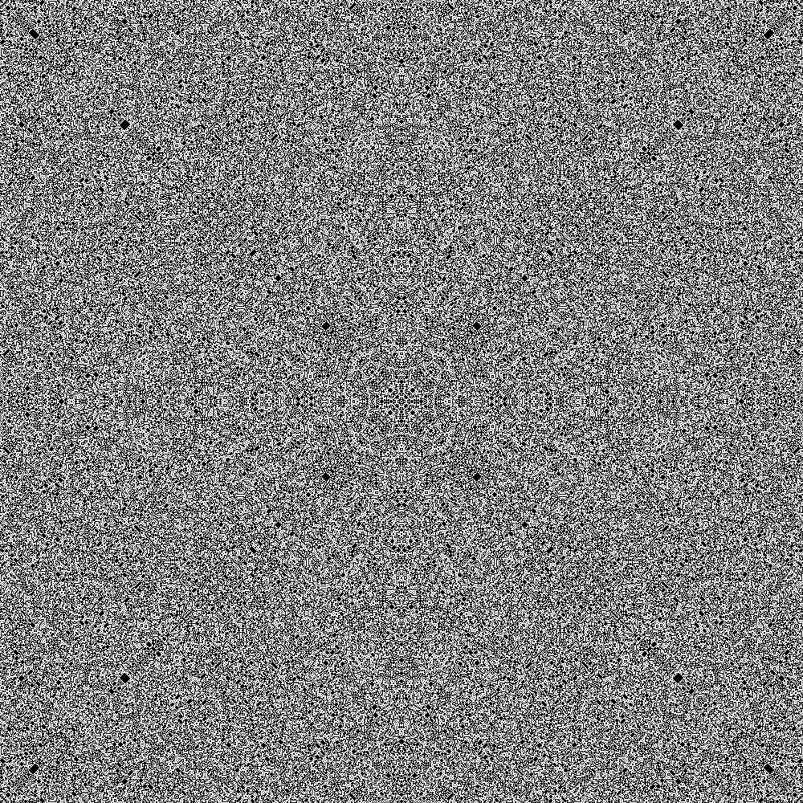

# LIGHTS-OUT-SOLVER

This is a solver for the lights out puzzle which start with all lights off and the goal is to turn all lights on.
It's for a large scale board, such as 1000x1000. The solution is generated as a png file.

## C++ Version

### Dependencies

- opencv
- boost

### Build

```bash
g++ lights_out_solver.cpp -o lights_out_solver `pkg-config --cflags --libs opencv4`
```

### Run

```bash
./lights_out_solver
```

## Python Version

### Dependencies

- numpy
- PIL

### Run

```bash
python lights_out_solver.py
```

## Attention

- This solver supports only m×n lights out puzzle with m < 2*n
- Too large scale puzzle (e.g. 10000x10000) may let png file too large to open.

## Example

### Input

```
python lights_out_solver.py

Width: 1000
Height: 1000
```

### Output


(White: unpressed, Black: pressed)


